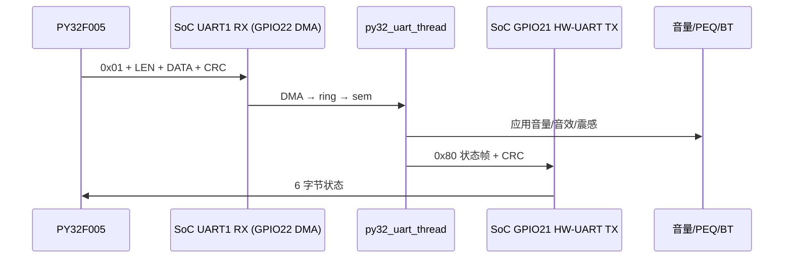
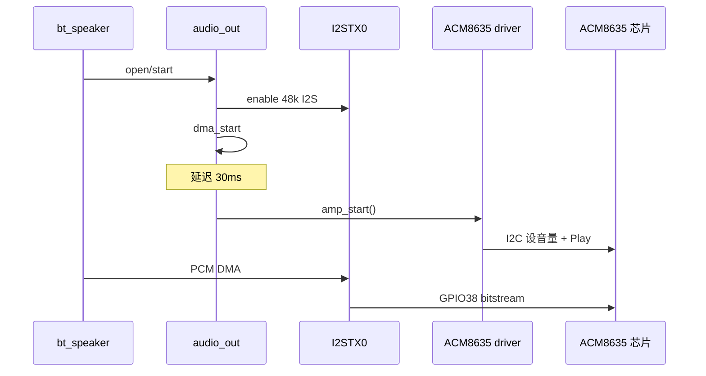
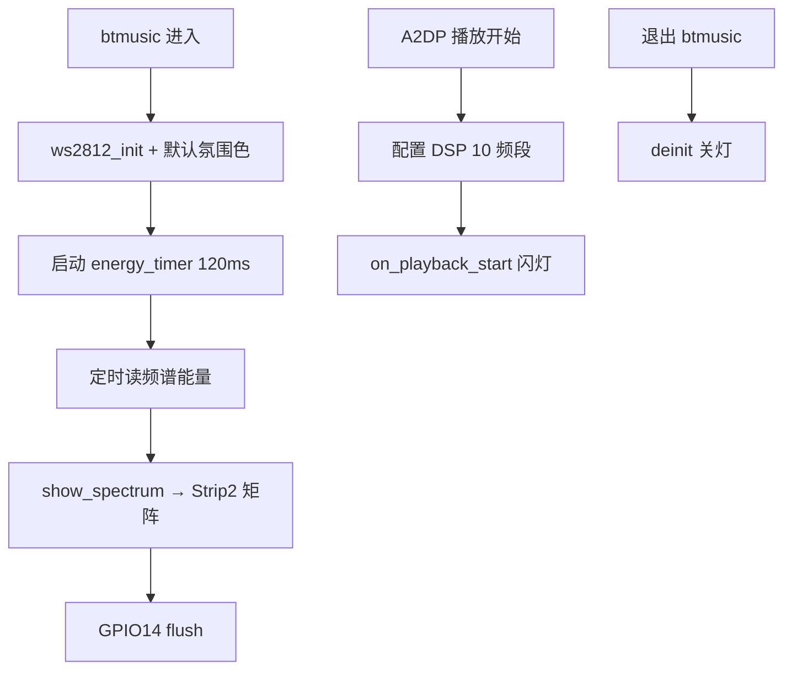

# 285L2 系统流程说明（PY32 / ACM8635 / 氛围灯 / 律动灯）

适用工程：`samples/bt_speaker/app_conf/285l2_mc_bt`  
板级：`boards/csky/ats2853p2_evb`（`board_285l2.h`）

---

## 1. 总览

```
                    ┌─────────────┐
   PY32F005 ─UART1─►│ ATS2853P2   │──I2C(bitbang)──► ACM8635 (功放/codec)
   (主控旋钮)       │  bt_speaker │──I2STX0────────► ACM8635 SDIN
                    │             │──GPIO8──────────► WS2812 氛围灯 (25颗)
                    │             │──GPIO14─────────► AMBIC 律动矩阵 (4×44)
                    └─────────────┘
```

| 模块 | 控制/数据接口 | 主要代码 |
|------|---------------|----------|
| PY32 通讯 | UART1：TX=GPIO21(硬件)，RX=GPIO22(DMA) | `system_app_py32_uart.c` |
| ACM8635 | I2C GPIO0/19；I2S GPIO6/39/38；PDN GPIO5 | `drivers/codec_acm8635/driver.c` |
| 氛围灯 Strip1 | GPIO8，WS2812 GRB，25 LED | `btmusic_ws2812.c` |
| 律动灯 Strip2 | GPIO14，AMBIC GBR，176 LED (4行×44列) | `btmusic_ws2812.c` |

**说明：** PY32 UART 协议只管音量/音效/震感，**不含灯带指令**。灯带由 btmusic 应用内独立驱动。

---

## 2. PY32 通讯流程

### 2.1 角色与引脚

| 项目 | 说明 |
|------|------|
| PY32 | **主机**，下发参数帧 |
| ATS2853P2 | **从机**，执行并回状态帧 |
| 波特率 | 115200 8N1 |
| TX (SoC→PY32) | **GPIO21**，UART1 硬件（MFP=0xe） |
| RX (PY32→SoC) | **GPIO22**，UART1 硬件 + DMA 收 |
| 调试串口 | UART0 GPIO2/3，与 PY32 无关 |

引脚定义：`boards/csky/ats2853p2_evb/board_285l2.h`  
上电 pinmux：`boards/csky/ats2853p2_evb/board.c`（`board_pin_config[]`）

### 2.2 启动时序

```
系统启动
  → BT 协议栈就绪 (MSG_BT_ENGINE_READY)
    → system_app_init_bte_ready()
      → system_app_py32_uart_init()
        → 延迟 1500 ms（等 UART0 调试口稳定）
          → py32_uart_do_init()
            → 绑定 UART_1
            → RX：DMA 半缓冲 + 500 µs 空闲超时
            → TX：GPIO21 硬件 UART（CPU poll）
            → 创建 py32_uart_thread（优先级 14，栈 2048）
```

| 阶段 | 文件 | 函数 |
|------|------|------|
| BT 就绪入口 | `system_app/system_app.c` | `MSG_BT_ENGINE_READY` 处理 |
| 初始化调度 | `system_app/system_app_init.c` | `system_app_py32_uart_init()` |
| 核心实现 | `system_app/system_app_py32_uart.c` | `py32_uart_do_init()` / `py32_uart_thread()` |

### 2.3 线程与数据流

```
PY32 字节流
  → UART1 RX DMA (256B ping-pong)
  → py32_dma_rx_isr / 空闲超时
  → 环形缓冲 (256B)
  → k_sem 唤醒 py32_uart_thread
  → 状态机解析：CMD → LEN → DATA → CRC_L → CRC_H
  → py32_handle_frame() 应用参数
  → py32_tx_status_frame() GPIO21 HW-UART 发回包
```

- **线程名：** `py32_uart_thread`
- **轮询：** `k_sem_take(..., 10ms)`，无数据时 10 ms 超时醒来
- **TX：** 硬件 UART（CPU poll），`py32_uart1_putc_hw()` 等 UTBB 清再写 txdat

### 2.4 协议帧格式

```
CMD (1B) + LEN (1B) + DATA[N] + CRC16_LE (2B)
```

CRC：Modbus 反射多项式 `0xA001`，初值 `0xFFFF`，覆盖 `CMD+LEN+DATA`。

#### 命令表

| CMD | 方向 | 名称 | DATA 长度 | 内容 |
|-----|------|------|-----------|------|
| `0x01` | PY32→SoC | SET_PARAMS | 4 | `[音量%, 高音, 低音, 震感]` |
| `0x80` | SoC→PY32 | STATUS_RSP | 6 | `[音量%, 高音, 低音, 震感, BT连接, 错误码]` |

#### 字段说明

| 字段 | 范围 | 作用 |
|------|------|------|
| 音量 | 0–100 | `system_volume_set()` |
| 高音/低音 | 0–24 | 12 = 0 dB；低音写 PEQ |
| 震感 | 0–100 | 仅存状态（无马达驱动） |
| BT连接 | 0/1 | `bt_manager_get_connected_dev_num()` |
| 错误码 | 见下表 | 回包携带 |

| err_code | 含义 |
|----------|------|
| 0x00 | OK |
| 0x01 | 不支持 CMD |
| 0x02 | 长度错误 |
| 0x03 | 数值非法 |
| 0x04 | CRC 失败 |
| 0x05 | 忙 |

#### 示例：音量 80%，高音/低音 0 dB，震感 50%

```
01 04 50 0C 0C 32 [CRC16_LE]
```

详细协议：`tools/PY32_UART_PROTOCOL.md`  
主机测试脚本：`tools/py32_uart_test.py`

### 2.5 prj.conf 关键项

```conf
CONFIG_SYSTEM_APP_PY32_UART=y
CONFIG_SYSTEM_APP_PY32_UART_DEV_NAME="UART_1"
CONFIG_SYSTEM_APP_PY32_UART_INIT_DELAY_MS=1500
CONFIG_BOARD_UART1_TX_GPIO=21	# 285L2 V2.1: GPIO21 (MFP=0xe); V2.0: GPIO7 (MFP=0x3)
CONFIG_BOARD_UART1_RX_GPIO=22
CONFIG_UART_ACTS_PORT_1_BAUD_RATE=115200
CONFIG_UART_DMA_RX_DRIVEN=y
CONFIG_UART_DMA_RX_TIMEOUT_DRIVEN=y
CONFIG_SYSTEM_APP_BLE_REMOTE_CMD=n    # 控制走 PY32，不走 BLE 远程
CONFIG_BT_CONTROLER_BQB=n             # BQB 会占用 UART1
```

### 2.6 时序图



---

## 3. ACM8635 音频流程

### 3.1 硬件连接（285L2）

| 信号 | GPIO | 说明 |
|------|------|------|
| I2C SCL | GPIO0 | 软件 bitbang |
| I2C SDA | GPIO19 | 软件 bitbang |
| I2C 地址 | 0x1C (7-bit) | 线地址字节 0x38 |
| PDN | GPIO5 | active-low；**板级 early init 拉高一次，驱动不再操作** |
| I2S LRCLK | GPIO6 | I2STX0 |
| I2S BCLK | GPIO39 | 64×FS |
| I2S DOUT→SDIN | GPIO38 | SoC → ACM8635 |
| MCLK | 无 | 片内时钟，无 MCLK 引脚 |

音频路径：**DSP/PCM → I2STX0 → GPIO38 → ACM8635**  
控制路径：**AMP API → I2C 写寄存器表**

### 3.2 软件架构

```
bt_speaker 应用
    ↓
audio_out (audio_out_acts_andes.c)
    ├─ I2STX0 打开/启 DMA
    └─ AMP API（设备名 "AMP"）
           ↓
drivers/codec_acm8635/driver.c
    ├─ init：加载 Awinic 寄存器表 + 音量
    ├─ amp_start：进 Play、设音量、清 fault
    └─ amp_stop：仅清 playing 标志（不写 mute/Hi-Z）
```

**注意：** `CONFIG_CODEC_ACM8635_DEV_NAME="ACM8635"` 仅为 Kconfig 名；实际 Zephyr 设备注册为 **`CONFIG_AMP_DEV_NAME="AMP"`**。

### 3.3 启动初始化

```
board_early_init()
  ├─ GPIO5 PDN 拉高（运行态，仅一次）
  ├─ pinmux：GPIO0/19 I2C，GPIO6/39/38 I2STX0
  └─ ...

POST_KERNEL 优先级 65：acm8635_init()
  ├─ 绑定 I2C 总线 "I2C_0"（GPIO bitbang）
  ├─ 配置 100 kHz
  ├─ I2C bus recovery（9 脉冲 + STOP）
  ├─ 读 chip id（表加载前，仅日志）
  ├─ 加载 acm8635_reg_tab_init → 等 10 ms
  ├─ 加载 acm8635_reg_tab_main
  ├─ acm8635_set_volume(INIT_VOLUME=8)
  └─ 注册 AMP 设备 "AMP"

POST_KERNEL 优先级 50：audio_out_init()
  └─ device_get_binding("AMP") → amp_open()（空操作）
```

寄存器表来源：`drivers/codec_acm8635/acm8635_regs.c`（厂商 GUI 默认 L+R 表）

### 3.4 播放时序（amp_start）

**设计要点：** 不在 I2STX open 时开功放，仅在 **DMA 开始送数后延迟 30 ms** 再 `amp_start`。

```
应用打开音频通道
  → acts_audio_out_open()
      └─ 使能 I2STX0（48 kHz / 24-bit / Master / I2S / 64FS）

应用 start + DMA 开始
  → acts_audio_out_start()
      └─ acm8635_schedule_amp_start("dma start", 30ms)
          └─ amp_start_work()
              └─ acm8635_amp_start()
                  ├─ acm8635_ensure_i2c_online()（读 0x15/0x04/0x16 探活）
                  ├─ 有 fault 则清 0x17–0x19
                  ├─ acm8635_set_volume()
                  ├─ acm8635_play_enable()（0x04=0x03 Play）
                  └─ 读状态/故障日志
```

| 常量 | 值 | 位置 |
|------|-----|------|
| `ACM8635_AMP_DEFER_DMA_MS` | 30 ms | `audio_out_acts_andes.c` |
| Play 控制寄存器 | page0 `0x04=0x03` | `driver.c` |
| 期望状态 | `0x04=0x03`, `0x16=0x03` | 诊断日志 |

### 3.5 停止时序（amp_stop）

```
acts_audio_out_stop()
  └─ amp_stop()
      └─ acm8635_amp_stop()
          └─ acm8635_amp_playing = false
          （不写 mute / Hi-Z / PDN，避免影响恢复）
```

### 3.6 I2C 在线检测（当前实现）

init 后 **不用** `0xFC/0xFD/0xFE` 做 chip id 校验（寄存器表会把它们清 0）。

`acm8635_ensure_i2c_online()` 流程：

1. 读 `0x15/0x04/0x16`，非全 0 → 在线
2. 失败 → TWI bus recovery 再试
3. 仍失败 → 最后手段 reload 整表 + 音量

### 3.7 prj.conf 关键项

```conf
CONFIG_AUDIO_OUTPUT_I2S=y
CONFIG_AUDIO_OUT_I2STX0_SUPPORT=y
CONFIG_AUDIO_OUT_I2STX_ALWAYS_ON=y
CONFIG_AUDIO_OUTPUT_SAMPLE_RATE=48

CONFIG_I2C_GPIO_1=y
CONFIG_I2C_GPIO_1_SCL_PIN=0
CONFIG_I2C_GPIO_1_SDA_PIN=19
CONFIG_CODEC_ACM8635=y
CONFIG_CODEC_ACM8635_I2C_BITBANG=y
CONFIG_CODEC_ACM8635_I2C_ADDR=0x1c
CONFIG_CODEC_ACM8635_I2C_BUS_100K=y
CONFIG_CODEC_ACM8635_INIT_VOLUME=8
CONFIG_CODEC_ACM8635_PDN_GPIO=5
CONFIG_CODEC_ACM8635_PDN_ACTIVE_LOW=y
CONFIG_AMP_DEV_NAME="AMP"
```

### 3.8 端到端时序



---

## 4. 氛围灯（Strip1，GPIO8）

### 4.1 硬件

| 项目 | 值 |
|------|-----|
| GPIO | **8** |
| 灯珠数 | **25**（`CONFIG_BT_MUSIC_LED_STRIP_COUNT`） |
| 协议 | WS2812，像素顺序 **GRB** |
| 角色 | 氛围灯：整带统一纯色，**不跟音乐频谱** |

### 4.2 配置

```conf
CONFIG_BT_MUSIC_LED_STRIP=y
CONFIG_BT_MUSIC_LED_STRIP_AMBIENT=y
CONFIG_BT_MUSIC_LED_STRIP_GPIO=8
CONFIG_BT_MUSIC_LED_STRIP_COUNT=25
```

`CONFIG_BT_MUSIC_LED_STRIP_AMBIENT=y` 时，频谱刷新**只更新 Strip2**，Strip1 保持环境色。

### 4.3 初始化与默认颜色

进入 **btmusic** 应用时（`_btmusic_main()`）：

```
btmusic_ws2812_init()
  ├─ GPIO8 初始化 + WS2812 时序校准
  ├─ 清空缓冲
  └─ btmusic_ws2812_ambient_set(32, 12, 0)   // 默认暖琥珀色
```

退出应用：`btmusic_ws2812_deinit()` 关灯。

### 4.4 API

| 函数 | 作用 |
|------|------|
| `btmusic_ws2812_ambient_set(r,g,b)` | 25 颗全设同一 RGB |
| `btmusic_ws2812_ambient_off()` | 氛围灯全灭 |
| `btmusic_ws2812_show_rgb(r,g,b)` | 底层 RGB 显示（非 ambient 模式用） |

头文件：`src/btmusic/btmusic_ws2812.h`  
实现：`src/btmusic/btmusic_ws2812.c`

---

## 5. 律动灯（Strip2，GPIO14）

### 5.1 硬件

| 项目 | 值 |
|------|-----|
| GPIO | **14** |
| 灯珠数 | **176** = 4 行 × 44 列 |
| 驱动芯片 | AMBIC1010 矩阵灯 |
| 像素顺序 | **GBR**（与 WS2812 GRB 不同） |
| 列高 | 每列最多亮 **4** 颗（`CONFIG_BT_MUSIC_LED_STRIP2_GROUP_SIZE=4`） |

布线：行 0 为底部；奇数行蛇形反转（`ws2812_strip2_px_index`）。

### 5.2 配置

```conf
CONFIG_BT_MUSIC_LED_STRIP2=y
CONFIG_BT_MUSIC_LED_RHYTHM=y
CONFIG_BT_MUSIC_LED_STRIP2_GPIO=14
CONFIG_BT_MUSIC_LED_STRIP2_COUNT=176
CONFIG_BT_MUSIC_LED_STRIP2_GROUP_SIZE=4
CONFIG_ENERGY_SAMPLE_SUPPORT=y
```

### 5.3 能量 / 频谱数据流

```
A2DP 播放 DSP
  → btmusic_output_energy_sample_config()   // 10 频段采样
  → energy_timer 每 120 ms
  → btmusic_a2dp_get_freqpoint_energy()   // 读 10 段能量
  → 平滑 + 归一化 band_lvl[0..9] (0-255)
  → btmusic_ws2812_show_spectrum()
      └─ ws2812_build_matrix_columns()     // 10 段插值到 44 列
      └─ ws2812_flush2() → GPIO14
```

#### 10 个频段（Hz）

100, 500, 1000, 1500, 2000, 3000, 5000, 8000, 10000, 15000

#### 列映射逻辑（简述）

- 10 段能量线性插值 → 44 列电平
- 列电平映射柱高：`lit = lvl * 4 / 255`（0~4 颗）
- 自底向上点亮；颜色按频段调色板；亮度上限 160

### 5.4 生命周期

| 事件 | 动作 |
|------|------|
| 进入 btmusic | `btmusic_ws2812_init()`，Strip2 底部一行红闪（自检） |
| 开始播放 | `btmusic_ws2812_on_playback_start()`，Strip2 底部红闪 400 ms |
| 播放中 | 120 ms 定时刷新律动矩阵 |
| 能量读失败 / 停止 | `btmusic_ws2812_strip2_clear()` |
| 退出 btmusic | `btmusic_ws2812_deinit()` |

相关文件：

| 文件 | 职责 |
|------|------|
| `btmusic_main.c` | `energy_timer`、`btmusic_rgb_rhythm_debug_poll()` |
| `btmusic_media.c` | DSP 能量配置、`btmusic_a2dp_get_freqpoint_energy()` |
| `btmusic_ws2812.c` | GPIO 时序、矩阵渲染、flush |

### 5.5 调试 Kconfig

| 选项 | 作用 |
|------|------|
| `BT_MUSIC_LED_STRIP_DEBUG_LOG` | 串口打印频段/列统计 |
| `BT_MUSIC_LED_STRIP2_RGB_ORDER_TEST` | 仅底部 44 颗红色（校 RGB 顺序） |
| `BT_MUSIC_LED_STRIP2_ROW_DEMO` | 四行固定 R/G/B/Y 演示 |

### 5.6 律动时序图



---

## 6. 四模块协作关系

| 场景 | PY32 | ACM8635 | 氛围灯 GPIO8 | 律动灯 GPIO14 |
|------|------|---------|--------------|---------------|
| 开机 | 等 BT 就绪后 1.5s 初始化 UART | 板级 PDN 高 + 驱动 load 表 | 未亮（进 btmusic 才 init） | 同上 |
| PY32 调音量 | UART 0x01 → 改系统音量 | 音量经 audio policy 映射到 AMP | 不变 | 不变 |
| BT 音乐播放 | 状态回包含连接位 | DMA 后 30ms amp_start，I2S 送数 | 保持环境色 | 120ms 频谱律动 |
| 退出 btmusic | UART 仍运行 | amp_stop 仅清标志 | deinit 熄灭 | deinit 熄灭 |

---

## 7. 关键文件索引

| 模块 | 路径 |
|------|------|
| PY32 驱动 | `samples/bt_speaker/src/system_app/system_app_py32_uart.c` |
| PY32 协议 | `samples/bt_speaker/tools/PY32_UART_PROTOCOL.md` |
| ACM8635 驱动 | `drivers/codec_acm8635/driver.c` |
| ACM8635 寄存器表 | `drivers/codec_acm8635/acm8635_regs.c` |
| 音频输出集成 | `drivers/audio/andes/audio_out_acts_andes.c` |
| 板级 pinmux/PDN | `boards/csky/ats2853p2_evb/board.c` |
| 灯带驱动 | `samples/bt_speaker/src/btmusic/btmusic_ws2812.c` |
| 灯带 Kconfig | `samples/bt_speaker/src/Kconfig` |
| 工程配置 | `samples/bt_speaker/app_conf/285l2_mc_bt/prj.conf` |
| 285L2 引脚表 | `boards/csky/ats2853p2_evb/board_285l2.h` |

---

## 8. 日志关键字（联调）

| 关键字 | 模块 |
|--------|------|
| `[py32]` | PY32 UART 初始化/收发 |
| `[acm8635]` | I2C init / amp_start / 状态寄存器 |
| `Schedule ACM8635 amp` | DMA 延迟开功放 |
| `[ws2812]` | 灯带时序校准 |
| `[rgb] energy` / `spectrum` | 律动频段能量 |
| `btmusic_ws2812` | 氛围/律动 init 与播放联动 |

---

*文档版本：与 285l2_mc_bt 当前 bring-up 状态一致（ACM8635 软 I2C、PDN 板级常高、PY32 GPIO21 HW-UART）。*
