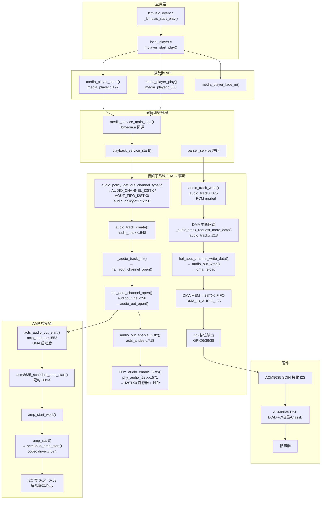
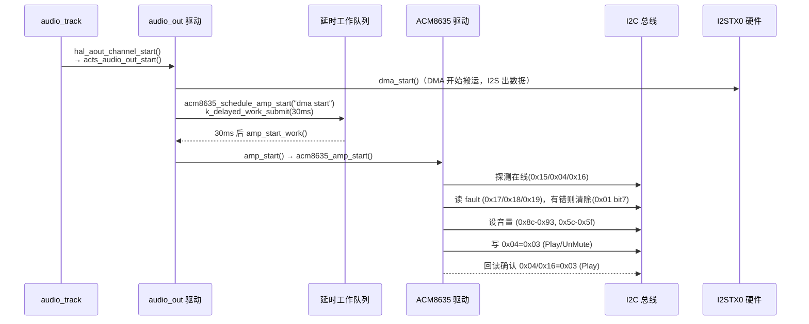
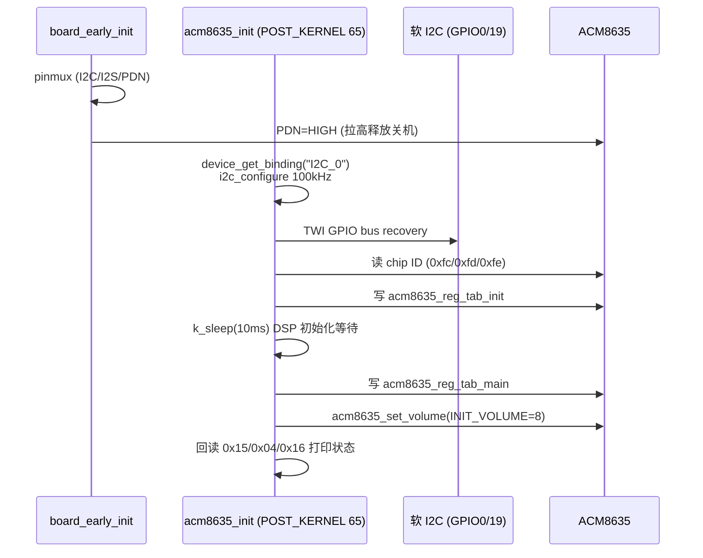

# ACM8635 播放音乐完整链路详解（ATS2853P2）

> 适用工程：`samples/bt_speaker/app_conf/285l2_mc_bt`
> 板级：`boards/csky/ats2853p2_evb`（285L2）
> 本文档供其他项目移植/参考使用，描述从**应用层发起播放**到**ACM8635 出声**的完整控制流与数据流。

---

## 1. 硬件连接与引脚

### 1.1 芯片连接图

```
ATS2853P2 (蓝牙 SoC)                          ACM8635 (DSP 功放 + Codec)
┌──────────────────────────┐                 ┌───────────────────────────┐
│                          │   I2S TX0 (主)  │                           │
│   GPIO6  (LRCLK) ────────┼────────────────►│  I2S LRCLK                │
│   GPIO39 (BCLK)  ────────┼────────────────►│  I2S BCLK                 │
│   GPIO38 (DOUT)  ────────┼────────────────►│  I2S SDIN   (3-wire, 无 MCLK)│
│                          │                 │                           │
│                          │   I2C (软件 GPIO bitbang, 100kHz)           │
│   GPIO0  (SCL) ──────────┼────────────────►│  I2C SCL                  │
│   GPIO19 (SDA) ──────────┼────────────────►│  I2C SDA  (7-bit addr 0x1C)│
│                          │                 │                           │
│   GPIO5  (PDN, 输出高) ───┼────────────────►│  PDNz  (低有效关机)        │
│                          │                 │                           │
│                     扬声器 ◄───────────────┤  SPK+ / SPK- (ClassD)     │
└──────────────────────────┘                 └───────────────────────────┘
```

### 1.2 关键引脚表

| 功能 | 引脚 | MFP/模式 | 说明 |
|------|------|----------|------|
| I2S LRCLK | GPIO6 | 0x9 | I2STX0 帧同步 |
| I2S BCLK | GPIO39 | 0x9 | I2STX0 位时钟 |
| I2S DOUT | GPIO38 | 0x9 | I2STX0 数据 → ACM8635 SDIN |
| I2S MCLK | GPIO40 | 不使能 | ACM8635 使用 3-wire，无需 MCLK |
| I2C SCL | GPIO0 | GPIO 模式（bitbang） | 软件 I2C |
| I2C SDA | GPIO19 | GPIO 模式（bitbang） | 软件 I2C |
| PDN | GPIO5 | GPIO 输出高 | active-low，板级 early init 拉高一次 |

引脚配置位置：`boards/csky/ats2853p2_evb/board.c` → `board_pin_config[]`

```c
/* board.c: i2s tx0 -> ACM8635 */
{39, 0x9 | GPIO_CTL_SMIT | GPIO_CTL_PADDRV_LEVEL(4)},  /* bclk */
{6,  0x9 | GPIO_CTL_SMIT | GPIO_CTL_PADDRV_LEVEL(4)},  /* lrclk */
{38, 0x9 | GPIO_CTL_SMIT | GPIO_CTL_PADDRV_LEVEL(4)},  /* dout -> codec SDIN */

/* 软 I2C */
{CONFIG_I2C_GPIO_1_SCL_PIN, GPIO_CTL_MFP_GPIO | GPIO_CTL_PULLUP | GPIO_CTL_SMIT | GPIO_CTL_PADDRV_LEVEL(3)},
{CONFIG_I2C_GPIO_1_SDA_PIN, GPIO_CTL_MFP_GPIO | GPIO_CTL_PULLUP | GPIO_CTL_SMIT | GPIO_CTL_PADDRV_LEVEL(3)},

/* PDN 输出高 */
{5, GPIO_CTL_MFP_GPIO | GPIO_CTL_GPIO_OUTEN | GPIO_CTL_SMIT | GPIO_CTL_PADDRV_LEVEL(3)},
```

PDN 在 `board_early_init()` 中由 `board_acm8635_pdn_init()` 拉高一次（`CONFIG_CODEC_ACM8635_PDN_ACTIVE_LOW=y` 时写 `GPIO_REG_BSR`），之后驱动不再触碰。

---

## 2. 软件架构分层总览

```
┌──────────────────────────────────────────────────────────────────────┐
│  应用层 (samples/bt_speaker/src)                                      │
│    lcmusic / btmusic / usound ...                                     │
│    local_player.c → media_player_open/play                            │
├──────────────────────────────────────────────────────────────────────┤
│  播放器 API 层 (ext/actions/media/media_player.c)                     │
│    消息封装：MSG_MEDIA_SRV_OPEN / MSG_MEDIA_SRV_PLAY                   │
├──────────────────────────────────────────────────────────────────────┤
│  媒体服务层 (ext/actions/media/libal/mips/libmedia.a ⚠️闭源)            │
│    media_service_main_loop → playback_service / parser_service        │
│    decoder（解码） + audio_track（输出轨道）                            │
├──────────────────────────────────────────────────────────────────────┤
│  音频子系统 (ext/actions/audio/ 有源码)                                │
│    audio_system / audio_policy / audio_track / audio_stream           │
│    volume_manager（音量同步到 AMP）                                    │
├──────────────────────────────────────────────────────────────────────┤
│  输出 HAL (ext/actions/porting/hal/audioout/audioout_hal.c)           │
│    hal_aout_channel_open / start / write_data / open_pa               │
├──────────────────────────────────────────────────────────────────────┤
│  音频输出驱动 (drivers/audio/andes/)                                   │
│    audio_out_acts_andes.c（会话/DMA/AMP 调度）                          │
│    audio_out_acts_inner.c（PA 开关）                                   │
│    phy/phy_audio_i2stx.c（I2STX0 寄存器配置）                          │
├──────────────────────────────────────────────────────────────────────┤
│  DMA 驱动 (drivers/dma/dma_acts_andes.c)                              │
│    MEMORY_TO_PERIPHERAL → I2S TX0 FIFO (DMA_ID_AUDIO_I2S)             │
├──────────────────────────────────────────────────────────────────────┤
│  AMP/Codec 驱动 (drivers/codec_acm8635/driver.c)                      │
│    以 AMP_DRIVER_API 注册，I2C 控制 ACM8635                           │
└──────────────────────────────────────────────────────────────────────┘
```

> **⚠️ 注意**：`media_service` / `playback_service` / `parser_service` 是**闭源预编译库**（`libmedia.a`），本文档中该层行为基于头文件（`media_service.h`）与周边源码调用关系推断。

---

## 3. 端到端播放链路图



---

## 4. 播放启动完整流程（时序）

### 4.1 应用层发起（以本地音乐 lcmusic 为例）

| 步骤 | 函数 | 文件:行 | 说明 |
|------|------|---------|------|
| 1 | `_lcmusic_start_play()` | `lcmusic_event.c:437` | 组装 `lcplay_param`（url/seek/断点/事件回调） |
| 2 | `mplayer_start_play()` | `local_player.c:241` | 创建文件流 → 填 `media_init_param_t` |
| 3 | `file_stream_create()/stream_open()` | `local_player.c:256-262` | 打开文件（SD/USB/Flash） |
| 4 | `media_player_open()` | `local_player.c:331` | 打开媒体服务 |
| 5 | `media_player_fade_in(100ms)` | `local_player.c:355` | 淡入 |
| 6 | `media_player_play()` | `local_player.c:368` | 开始播放 |

关键参数（`local_player.c:272-298`）：

```c
init_param.type          = MEDIA_SRV_TYPE_PARSER_AND_PLAYBACK;
init_param.stream_type   = AUDIO_STREAM_LOCAL_MUSIC;
init_param.efx_stream_type = AUDIO_STREAM_LOCAL_MUSIC;
init_param.format        = get_music_file_type(url);  /* MP3/AAC/WAV/... */
init_param.input_stream  = lcplayer->file_stream;     /* 解码输入 */
init_param.output_stream = NULL;
init_param.sample_bits   = 32;
init_param.event_notify_handle = lcparam->play_event_callback;
init_param.support_tws   = 1;
```

### 4.2 播放器 API 层（消息封装）

| 函数 | 文件:行 | 行为 |
|------|---------|------|
| `media_player_open()` | `media_player.c:192` | 分配 handle → 填 `media_srv_init_param_t` → 发送 **`MSG_MEDIA_SRV_OPEN`**（带同步信号量）→ 等待服务端返回 `media_srv_handle` |
| `media_player_play()` | `media_player.c:356` | 发送 **`MSG_MEDIA_SRV_PLAY`**；`sys_wake_lock(WAKELOCK_PLAYER)` 防待机 |

消息投递：`send_async_msg(MEDIA_SERVICE_NAME, &msg)` → `msg_manager_send_async_msg()`，由 media 服务线程消费。

### 4.3 媒体服务线程

- 服务线程在系统初始化时注册：`ext/actions/system/system_init.c:17-25` 的 `SERVICE_DEFINE(media, ...)`。
- 主循环 `media_service_main_loop()`（libmedia.a）负责分发 `MSG_MEDIA_SRV_*`。
- `media_service_open()`（libmedia.a）创建三个子服务：**playback_service / parser_service / capture_service**。
- `media_service_play()` → `playback_service_start()`：
  1. 通过 `audio_policy_*` 查询输出通道/采样率
  2. `audio_track_create()` 创建输出轨道
  3. 从 `input_stream` 读数据 → 解码器解码 → `audio_track_write()` 写 PCM

### 4.4 输出通道策略（关键决策点）

`audio_policy.c` 决定数据走哪条路：

```c
/* audio_policy.c:173 通道类型 */
int audio_policy_get_out_channel_type(uint8_t stream_type)
{
    int out_channel = AUDIO_CHANNEL_DAC;   /* 默认 DAC */
    if (user_policy) out_channel = user_policy->audio_out_channel;
    ...
}

/* audio_policy.c:250 通道 ID */
int audio_policy_get_out_channel_id(uint8_t stream_type)
{
    int out_channel_id = AOUT_FIFO_DAC0;
#ifdef CONFIG_AUDIO_OUTPUT_I2S
    out_channel_id = AOUT_FIFO_I2STX0;     /* ← 285L2 配置 CONFIG_AUDIO_OUTPUT_I2S=y */
#endif
    ...
}
```

| 配置项 | 值 | 效果 |
|--------|-----|------|
| `CONFIG_AUDIO_OUTPUT_I2S=y` | 所有音乐流输出到 I2STX0 | 通道 ID = `AOUT_FIFO_I2STX0(2)` |
| `CONFIG_AUDIO_OUT_I2STX0_SUPPORT=y` | 使能 I2S TX0 硬件 | GPIO6/39/38 复用 |
| `CONFIG_AUDIO_OUTPUT_SAMPLE_RATE=48` | 输出采样率 48kHz | — |

FIFO 常量（`ext/actions/porting/include/audio_hal.h:59-61`）：

```c
#define AOUT_FIFO_DAC0     0   /* 内置 DAC */
#define AOUT_FIFO_DAC1     1
#define AOUT_FIFO_I2STX0   2   /* 外部 I2S DAC/功放（ACM8635 走这里）*/
```

### 4.5 创建输出轨道（audio_track）

`audio_track_create()`（`audio_track.c:548`）：

| 步骤 | 行号 | 说明 |
|------|------|------|
| 查询通道类型 | L560 | `audio_policy_get_out_channel_type()` → `AUDIO_CHANNEL_I2STX` |
| 查询通道 ID | L561 | `audio_policy_get_out_channel_id()` → `AOUT_FIFO_I2STX0` |
| 查询通道模式 | L562 | `AUDIO_DMA_MODE \| AUDIO_DMA_RELOAD_MODE`（DMA 重载模式） |
| 输出采样率 | L563 | `audio_system_get_output_sample_rate()` → 48kHz |
| 初始化硬件通道 | L580 | `_audio_track_init()` → `hal_aout_channel_open()` |
| 创建 PCM ringbuf | L596-608 | `ringbuff_stream_create(media_mem_get_cache_pool(OUTPUT_PCM, ...))` |
| 注册水线回调 | L628 | `stream_set_observer(..., _audio_track_stream_observer_notify, ...)` |

`_audio_track_init()`（`audio_track.c:382`）：
- `aout_param.sample_rate = output_sample_rate`（48k）
- `aout_param.channel_type = AUDIO_CHANNEL_I2STX`
- `aout_param.channel_id = AOUT_FIFO_I2STX0`
- `aout_param.data_width = 32`（`sample_bits=32`）
- `aout_param.dma_reload = 1; reload_len = pcm_frame_size; reload_addr = pcm_frame_buff`
- `aout_param.callback = _audio_track_request_more_data`（DMA 中断回调）
- → `hal_aout_channel_open(&aout_param)`

---

## 5. HAL → 驱动 → 硬件 的打开过程

### 5.1 `hal_aout_channel_open()`（audioout_hal.c:56）

```c
aout_param.sample_rate   = init_param->sample_rate;      /* 48000 */
aout_param.channel_type  = init_param->channel_type;     /* AUDIO_CHANNEL_I2STX */
aout_param.outfifo_type  = init_param->channel_id;       /* AOUT_FIFO_I2STX0 */
aout_param.channel_width = 24bit(32bit data);            /* CHANNEL_WIDTH_24BITS */
aout_param.callback      = _audio_track_request_more_data;
aout_param.reload_setting = &reload_setting;             /* DMA reload 地址/长度 */
handle = audio_out_open(audio_out->aout_dev, &aout_param);
```

### 5.2 `acts_audio_out_open()`（audio_out_acts_andes.c:880）

| 步骤 | 说明 |
|------|------|
| 获取会话 | `audio_out_session_get(channel_type)` |
| 填充通道节点 | fifo_sel=I2STX0、sample_rate=48k、data_mode=STEREO、dma_width=4（32bit） |
| 使能 I2STX | `audio_out_enable_i2stx()`（channel_type & AUDIO_CHANNEL_I2STX） |
| DMA 准备 | `audio_out_dma_prepare()` → `audio_out_config()` |

### 5.3 `audio_out_enable_i2stx()`（acts_andes.c:718）

```c
channel_node->channel_type = AOUT_CHANNEL_I2S;
phy_i2stx_setting.i2stx_sample_rate = param->sample_rate;   /* 48k */
phy_i2stx_setting.i2stx_role        = CONFIG_I2STX_MODE 或 I2S_DEVICE_MASTER;
phy_i2stx_setting.i2stx_format      = I2S_FORMAT_I2S;       /* 标准 I2S */
phy_param.aout_fifo_sel             = AOUT_FIFO_I2STX0;
phy_param.aout_fifo_src_type        = AOUT_FIFO_SRC_DMA;
return PHY_audio_enable_i2stx(dev, &phy_param, &session->channel);
```

### 5.4 `PHY_audio_enable_i2stx()`（phy_audio_i2stx.c:571）—— I2STX0 硬件初始化

| 步骤 | 函数 | 说明 |
|------|------|------|
| 初始化 I2S TX | `phy_i2stx0_init()` | 复位/使能 I2S 模块 |
| 时钟配置 | `phy_i2stx0_clk_config()` | 主模式、内部时钟 `AOUT_I2S_CLK_I2S0CLK`、`CONFIG_I2STX_BCLK_RATE` |
| 控制器配置 | `phy_i2stx0_ctl_config()` | 格式/主从/位宽 |
| FIFO 配置 | `phy_i2stx0_fifo_config()` | FIFO 源选择（`AOUT_FIFO_SRC_DMA`）、中断/请求使能 |
| 使能 | `i2stx_reg->tx0_ctl \|= I2STX0_CTL_TXEN` | 打开 TX 移位输出 |

> 285L2 为 3-wire（无 MCLK），`GPIO40`（MCLK）在 `CONFIG_CODEC_ACM8635` 下**不使能**。

### 5.5 DMA 配置（audio_out_acts_andes.c）

`audio_out_config()` → `audio_out_dma_config()`（acts_andes.c:358）：

| 参数 | 值 |
|------|-----|
| `channel_direction` | `MEMORY_TO_PERIPHERAL`（内存→I2S FIFO） |
| `dma_slot` | **`DMA_ID_AUDIO_I2S`**（channel_fifo_sel == AOUT_FIFO_I2STX0） |
| `source_data_size` | 4（32bit）/ 2（16bit） |
| `source_burst_length` | 8 |
| `dma_reload` | 1（reload 模式） |
| 回调 | `_audio_out_write_data_reload_dma_cb`（HF/TC 中断） |
| FIFO DMA 宽度 | `I2STX0_FIFOCTL_DMAWIDTH_32` |

DMA 中断回调把 `AOUT_DMA_IRQ_HF` / `AOUT_DMA_IRQ_TC` 上报给 `_audio_track_request_more_data()`。

---

## 6. 数据流（PCM 从解码器到扬声器）

```
解码器 (playback_service, libmedia.a)
   │ audio_track_write()              audio_track.c:875
   │   └─ stream_write(ringbuf)       audio_track.c:881
   ▼
OUTPUT_PCM ringbuf (media_mem pool)
   │ 写满 pcm_frame_size 水线
   ▼
_audio_track_stream_observer_notify  audio_track.c:454
   │  预读一帧 → hal_aout_channel_start()   (DMA reload 启动)
   ▼
DMA 中断 (HF/TC)
   ▼
_audio_track_request_more_data()     audio_track.c:218
   │  从 ringbuf 读 PCM（_stream_read）
   │  可选：淡入淡出 / 混音 / 静音填零
   │  hal_aout_channel_write_data()   audio_track.c:505
   ▼
audio_out_write() → dma_reload()     acts_andes.c:1615
   ▼
DMA 引擎：内存 → I2S TX0 FIFO
   ▼
I2S 移位器：BCLK/LRCLK/DOUT
   ▼
GPIO38(DOUT) → ACM8635 SDIN
   ▼
ACM8635 DSP（EQ/DRC/音量）→ ClassD → 扬声器
```

### 6.1 关键实现细节

**写入入口**：解码线程把解码后的 PCM 通过 `audio_track_write()` 写入轨道 ringbuf。

**启动触发**：`_audio_track_stream_observer_notify()`（audio_track.c:454）检测到 ringbuf 数据 ≥ `pcm_frame_size` 且未启动时：
- 预读一帧到 `pcm_frame_buff`
- `hal_aout_channel_start()` → `audio_out_start()`（DMA reload 模式只启动一次）

**持续供数**：DMA 完成一半/全部时触发 `_audio_track_request_more_data()`（audio_track.c:218）：
- reload 模式：`AOUT_DMA_IRQ_HF` 写前半帧，`AOUT_DMA_IRQ_TC` 写后半帧（ping-pong）
- 数据不足时填 0（防欠载）
- 最终 `hal_aout_channel_write_data()` → `audio_out_write()` → `_audio_dma_reload()`

**audio_out_write()**（acts_andes.c:1615）：
```c
channel_node->dma_buf_ptr = buffer;
channel_node->dma_first_buf_size = length;
_audio_dma_reload(data->dma_dev, channel_node, (u32_t)buffer, length);
ret = audio_out_start(dev, handle);   /* 重载后重启 DMA */
```

---

## 7. 控制流：AMP（ACM8635）启动时序

这是 ACM8635 特有的关键逻辑。与 AW882XX 不同，**ACM8635 的 amp_start 必须在 DMA/I2S 真正开始出数据之后才执行**（I2S+PCM 就绪后再解除静音，避免爆音）。

### 7.1 驱动注册

`drivers/codec_acm8635/driver.c:701`：
```c
DEVICE_AND_API_INIT(acm8635, CONFIG_AMP_DEV_NAME, acm8635_init,
                    &acm8635_dev_data, NULL, POST_KERNEL, 65,
                    &acm8635_amp_driver_api);
```
- 设备名 `CONFIG_AMP_DEV_NAME`（默认 "ACM8635"）
- 以 `AMP_DRIVER_API` 注册：`open/close/start/stop/set_vol/set_reg/dump_regs`
- 初始化优先级 65（POST_KERNEL）

### 7.2 audio_out 初始化时挂接 AMP

`audio_out_init()`（acts_andes.c:1739）：

```c
#ifdef CONFIG_CODEC_ACM8635
    data->amp_dev = device_get_binding(CONFIG_AMP_DEV_NAME);
    if (!data->amp_dev) { ... return -1; }
#endif
#if defined(CONFIG_AMP_AW882XX) || defined(CONFIG_CODEC_ACM8635)
    if (data->amp_dev != NULL) {
        amp_open(data->amp_dev);              /* 只打日志，不做硬件操作 */
        k_delayed_work_init(&amp_work, amp_start_work);  /* 延时工作队列 */
    }
#endif
```

### 7.3 启动时序（关键）



关键代码（acts_andes.c:855-905）：

```c
#define ACM8635_AMP_DEFER_OPEN_MS  15
#define ACM8635_AMP_DEFER_DMA_MS   30

static void acm8635_schedule_amp_start(struct acts_audio_out_data *data,
                                       const char *reason)
{
    u32_t defer_ms = ACM8635_AMP_DEFER_OPEN_MS;
    if (reason && !strcmp(reason, "dma start")) {
        defer_ms = ACM8635_AMP_DEFER_DMA_MS;   /* DMA 启动后延 30ms */
    }
    k_delayed_work_cancel(&amp_work);
    k_delayed_work_submit(&amp_work, defer_ms);
}
```

触发点（acts_audio_out_start(), acts_andes.c:1595-1605）：

```c
#elif defined(CONFIG_CODEC_ACM8635)
    if ((session->channel_type & AUDIO_CHANNEL_I2STX) &&
        !(session->flags & AOUT_SESSION_START)) {
        acm8635_schedule_amp_start(data, "dma start");   /* 仅首次 DMA 启动时 */
    }
#endif
```

### 7.4 `acm8635_amp_start()`（codec driver.c:574）详细步骤

| 步骤 | 函数 | 说明 |
|------|------|------|
| 1 | `acm8635_ensure_i2c_online()` | 读 0x15/0x04/0x16，若全 0 则做 **TWI GPIO 总线恢复**（9 个 SCL 脉冲），再失败则重载 DSP 寄存器表 |
| 2 | 检查已播放 | 若 0x04==0x03 且 `acm8635_amp_playing`，直接返回 |
| 3 | `acm8635_read_fault_regs()` | 读 0x17/0x18/0x19 故障寄存器，有错则 `acm8635_recover_faults()` |
| 4 | `acm8635_set_volume()` | 写 L/R/Sub 三路 DSP 音量（0x8c-0x93、0x5c-0x5f） |
| 5 | `acm8635_play_enable()` | 写 page0 `0x04=0x03`（UnMute / Play） |
| 6 | `k_sleep(10ms)` | 稳定等待 |
| 7 | 回读确认 | 0x04/0x16 应为 0x03；非 0x03 则重试一次 play_enable |
| 8 | 故障复查 | 仍有 fault 则清除并重新 play_enable |

### 7.5 停止

`acts_audio_out_stop()`（acts_andes.c:1672）：

```c
#elif defined(CONFIG_CODEC_ACM8635)
    if (data->amp_dev != NULL) {
        amp_stop(data->amp_dev);   /* → acm8635_amp_stop() */
    }
#endif
```

`acm8635_amp_stop()`（codec driver.c:667）：**只置 `acm8635_amp_playing=false`，不做任何 I2C 写**（vendor 警告：mute + PDN 会破坏恢复）。

---

## 8. 音量控制链路

### 8.1 音量同步到 ACM8635

`volume_manager.c:133`（`system_volume_set()`）与 `volume_manager.c:261`（`system_player_volume_set()`）：

```c
#ifdef CONFIG_CODEC_ACM8635
    if (stream_type == AUDIO_STREAM_MUSIC || AUDIO_STREAM_VOICE ||
        AUDIO_STREAM_TTS || AUDIO_STREAM_LINEIN ||
        AUDIO_STREAM_USOUND || AUDIO_STREAM_LE_AUDIO ||
        AUDIO_STREAM_LOCAL_MUSIC) {
        struct device *amp_dev = device_get_binding(CONFIG_AMP_DEV_NAME);
        if (amp_dev != NULL) {
            amp_set_volume(amp_dev, (u8_t)volume);   /* → acm8635_set_volume() */
        }
    }
#endif
```

链路：`system_volume_set(stream, vol)` → `amp_set_volume()` → `acm8635_amp_set_volume()` → `acm8635_set_volume()`。

### 8.2 `acm8635_set_volume()`（codec driver.c:390）

与 vendor `volumeControl()` 相同序列，写 **L/R/Sub 三路 DSP 预增益**：

```c
vol_bytes = &acm8635_vol_table[4 * (16 - vol)];   /* 0-16 级，16=0dB */

/* Left */
写 page 0x04: 0x8c/0x8d/0x8e/0x8f = vol_bytes[0..3]
/* Right */
写 page 0x04: 0x90/0x91/0x92/0x93 = vol_bytes[0..3]
/* Sub  */
写 page 0x0c: 0x5c/0x5d/0x5e/0x5f = vol_bytes[0..3]
```

音量映射：`vol=16 → 0dB`，`vol=8 → ≈-18.5dB`，`vol=0 → ≈-109.5dB`（接近静音）。
音量表：`acm8635_vol_table[]`（`acm8635_regs.c`，4 字节/级）。

### 8.3 与 PA 音量区别

- **DAC 通道**（内置 PA）走 `PHY_audio_enable_dac()` 的 `dac_gain` 与 `AOUT_CMD_SET_VOLUME`。
- **I2STX0 通道**没有 DAC 增益，**音量完全由 ACM8635 内部 DSP 音量寄存器控制**（`acm8635_set_volume`）。
- 内置 PA 开关：`AOUT_CMD_OPEN_PA/CLOSE_PA` → `audio_out_open_pa()/close_pa()`（inner.c:338/397）→ `PHY_audio_enable_pa/disable_pa`。**285L2 + ACM8635 不使用内置 PA**（`CONFIG_BOARD_EXTERNAL_PA_ENABLE=n`，无 `board_extern_pa_ctl`）。

---

## 9. ACM8635 驱动初始化流程

### 9.1 上电时序



### 9.2 `acm8635_init()`（codec driver.c:526）

| 步骤 | 说明 |
|------|------|
| 绑定 I2C 设备 | `device_get_binding(CONFIG_CODEC_ACM8635_I2C_NAME)`（"I2C_0"，即软 I2C bitbang） |
| 配置 I2C 速率 | `CONFIG_CODEC_ACM8635_I2C_BUS_100K` → `I2C_SPEED_STANDARD`（100kHz） |
| TWI 总线恢复 | `acm8635_i2c_bus_recovery()`：GPIO 模拟 9 个 SCL 脉冲清总线 |
| 读 chip ID | 0xfc=0x86, 0xfd=0x25, 0xfe=0x53 |
| 加载寄存器表 | `acm8635_load_reg_tables()` |

### 9.3 寄存器表（acm8635_regs.c）

| 表 | 内容 | 延迟 |
|----|------|------|
| `acm8635_reg_tab_init[]` | 基础初始化（写 0x04=0x00、写 chip ID 0xfc/0xfd/0xfe、page1 0x02=0x20） | 之后 `k_sleep(CONFIG_CODEC_ACM8635_DSP_INIT_DELAY_MS=10)` |
| `acm8635_reg_tab_main[]` | 主配置：page0/1/4/5/6 等全量 DSP 配置（EQ/DRC/音量初始、Page5 0xc8-0xff、Page6 等） | `CONFIG_CODEC_ACM8635_DSP_MAIN_DELAY_MS=0` |

> 表格来源为 Awinic ACM8635 GUI 导出：`ACM8635_export_ACM8635-0X38-.c`。
> 285L2 实际只用 **page0/1/4/5/6** 相关寄存器；`0x04`（Play/静音控制）在播放时才写 0x03。

---

## 10. 关键配置文件（prj.conf）

`app_conf/285l2_mc_bt/prj.conf`：

```kconfig
# ---- 音频输出 ----
CONFIG_AUDIO_OUTPUT_SAMPLE_RATE=48
CONFIG_AUDIO_OUTPUT_I2S=y               # 输出到 I2STX0
CONFIG_AUDIO_OUT_I2STX0_SUPPORT=y
CONFIG_AUDIO_OUT_I2STX_ALWAYS_ON=y      # I2STX 常开（避免反复开关）
CONFIG_AUDIO_OUT_STEREO_ENABLE=y

# ---- 软件 I2C（GPIO bitbang）----
CONFIG_I2C=y
CONFIG_I2C_GPIO=y
CONFIG_I2C_GPIO_1=y
CONFIG_I2C_GPIO_1_GPIO="GPIO_0"
CONFIG_I2C_GPIO_1_SCL_PIN=0
CONFIG_I2C_GPIO_1_SDA_PIN=19
CONFIG_I2C_GPIO_1_NAME="I2C_0"

# ---- ACM8635 ----
CONFIG_CODEC_ACM8635=y
CONFIG_CODEC_ACM8635_DEV_NAME="ACM8635"
CONFIG_CODEC_ACM8635_I2C_NAME="I2C_0"
CONFIG_CODEC_ACM8635_INIT_VOLUME=8
CONFIG_CODEC_ACM8635_I2C_ADDR=0x1c
CONFIG_CODEC_ACM8635_I2C_FORCE_WRITE=y
CONFIG_CODEC_ACM8635_I2C_BITBANG=y
CONFIG_CODEC_ACM8635_I2C_BUS_100K=y     # 100kHz（ACM8635 最高支持 400k）
CONFIG_CODEC_ACM8635_PDN_GPIO=5
CONFIG_CODEC_ACM8635_PDN_ACTIVE_LOW=y

# ---- 音量 ----
CONFIG_VOLUME_MANAGER=y
CONFIG_AUDIO_VOLUME_PA=y
```

其他相关 Kconfig（`drivers/codec_acm8635/Kconfig`）：
- `CONFIG_CODEC_ACM8635_DSP_INIT_DELAY_MS=10`：init 表与 main 表之间延时
- `CONFIG_CODEC_ACM8635_DSP_MAIN_DELAY_MS=0`：main 表后附加延时
- `CONFIG_CODEC_ACM8635_PDN_DELAY_MS`：PDN 释放后到 I2C 的延时

---

## 11. 关键文件清单

| 层 | 文件 | 关键函数 |
|----|------|----------|
| 应用 | `samples/bt_speaker/src/lcmusic/local_player.c` | `mplayer_start_play()` :241 |
| 应用 | `samples/bt_speaker/src/lcmusic/lcmusic_event.c` | `_lcmusic_start_play()` :437 |
| 播放器 API | `ext/actions/media/media_player.c` | `media_player_open()` :192, `media_player_play()` :356 |
| 媒体服务（闭源） | `ext/actions/media/libal/mips/libmedia.a` | `media_service_open/play`, `playback_service` |
| 服务线程注册 | `ext/actions/system/system_init.c` | `SERVICE_DEFINE(media,...)` :17 |
| 音频策略 | `ext/actions/audio/audio_policy.c` | `audio_policy_get_out_channel_type()` :173, `_id()` :250 |
| 输出轨道 | `ext/actions/audio/audio_track.c` | `audio_track_create()` :548, `_audio_track_request_more_data()` :218, `audio_track_write()` :875 |
| 音量管理 | `ext/actions/audio/volume_manager.c` | `system_volume_set()` → `amp_set_volume()` :133 |
| 输出 HAL | `ext/actions/porting/hal/audioout/audioout_hal.c` | `hal_aout_channel_open()` :56, `hal_aout_channel_write_data()` :129 |
| 输出驱动 | `drivers/audio/andes/audio_out_acts_andes.c` | `acts_audio_out_open()` :880, `audio_out_enable_i2stx()` :718, `acts_audio_out_start()` :1552, `acts_audio_out_stop()` :1672, `audio_out_init()` :1739, `audio_out_dma_config()` :358 |
| PA 开关 | `drivers/audio/andes/audio_out_acts_inner.c` | `audio_out_open_pa()` :338, `audio_out_close_pa()` :397 |
| I2S PHY | `drivers/audio/andes/phy/phy_audio_i2stx.c` | `PHY_audio_enable_i2stx()` :571, `phy_i2stx0_fifo_config()` :460 |
| DMA | `drivers/dma/dma_acts_andes.c` | `dma_acts_config()` :112, `dma_acts_irq()` :209 |
| **Codec/AMP** | `drivers/codec_acm8635/driver.c` | `acm8635_init()` :526, `acm8635_amp_start()` :574, `acm8635_set_volume()` :390, `acm8635_play_enable()` :471 |
| 寄存器表 | `drivers/codec_acm8635/acm8635_regs.c` | `acm8635_reg_tab_init/main`, `acm8635_vol_table` |
| 板级 | `boards/csky/ats2853p2_evb/board.c` | `board_pin_config[]`, `board_acm8635_pdn_init()` :556 |

---

## 12. 移植到新项目的检查清单

### 12.1 硬件确认
- [ ] I2S 3-wire：LRCLK/BCLK/DOUT 引脚 MFP 复用正确（无 MCLK 需求）
- [ ] I2C：SCL/SDA 上拉，7-bit 地址正确（0x1C ↔ 线地址 0x38）
- [ ] PDN：active-low，板上电需拉高；确认 PDN 与外部 PA 控制引脚不冲突
- [ ] 扬声器接到 ACM8635 SPK+/-（ClassD 直接驱动）

### 12.2 软件确认
- [ ] `CONFIG_CODEC_ACM8635=y` 且 AMP 设备名一致（`CONFIG_AMP_DEV_NAME`）
- [ ] `CONFIG_AUDIO_OUTPUT_I2S=y` → 输出通道为 `AOUT_FIFO_I2STX0`
- [ ] `CONFIG_AUDIO_OUT_I2STX0_SUPPORT=y`
- [ ] `CONFIG_CODEC_ACM8635_INIT_VOLUME` 非 0（0 会静音）
- [ ] 寄存器表 `acm8635_reg_tab_init/main` 已从 vendor GUI 导出并放入 `acm8635_regs.c`
- [ ] DMA slot 使用 `DMA_ID_AUDIO_I2S`，方向 `MEMORY_TO_PERIPHERAL`
- [ ] amp_start 延时至 DMA 启动后（避免爆音）
- [ ] 音量：`system_volume_set` 已通过 `amp_set_volume` 同步到 ACM8635

### 12.3 已知坑（来自实际调试）
| 现象 | 原因 | 对策 |
|------|------|------|
| 无声 | WS2812 `irq_lock` 阻塞 DMA 中断 5ms → I2S 欠载 | 律动灯交给外部 MCU / 用 DMA 驱动，禁止长时间关中断 |
| 噗噗声 | 灯带电流纹波/DMA 竞争/动态水线 | 关闭灯带；`audio_policy_set_user_dynamic_waterlevel_ms` 副作用大，勿用 |
| A2DP 无声 | DSP 频带能量采集与 SBC/AAC 解码冲突 | 蓝牙通路关闭 `f_band_energy_en`（本地播放可用） |
| I2C 卡死 | 芯片异常占用总线 | 驱动内置 TWI GPIO 恢复（9 个 SCL 脉冲）+ 重载寄存器表 |

---

## 13. 时序小结（从按下播放到出声）

```
t=0ms     应用层 media_player_play()
t≈0ms     playback_service_start → audio_track_create → hal_aout_channel_open
          → audio_out_open → PHY_audio_enable_i2stx（I2S 时钟/引脚就绪）
t≈0ms     解码器开始解码 → audio_track_write 灌 ringbuf
t≈几ms    ringbuf 满水线 → hal_aout_channel_start → DMA 开始搬数 → I2S 出数据
t+30ms    延时工作队列 → amp_start → ACM8635 0x04=0x03（解除静音/Play）
t+30ms+   ACM8635 DSP 处理 → ClassD → 扬声器出声
```

---

*文档生成日期：2026-08-05 · 基于 ZS285L2 `samples/bt_speaker/app_conf/285l2_mc_bt` 工程源码*
